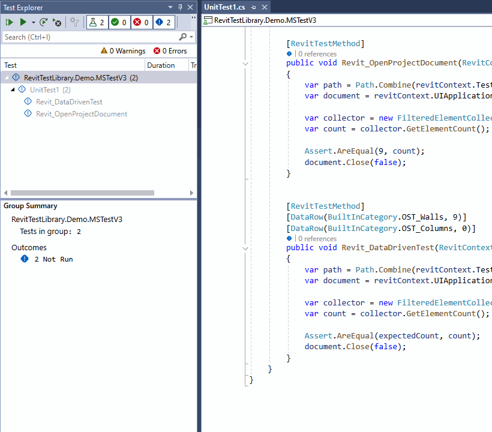

[](https://www.nuget.org/packages?q=RevitTestLibrary)

> **Warning**
Since version v.0.1 the RTL switched to .net 8 (Revit 2025), any further development on .net framework 4.8 (Revit 2023, 2024) is not planned.


# RevitTestLibrary (RTL)
Proof of Concept that it is possible to run and debug unit tests in Visual Studio with remote execution inside Revit.




## Origin

- [RevitTestFramework ](https://github.com/DynamoDS/RevitTestFramework)
- [Revit.TestRunner](https://github.com/geberit/Revit.TestRunner)
- [xUnitRevit](https://github.com/specklesystems/xUnitRevit)

We have three established solutions for unit testing in Revit space, but none of them is integrated with the IDE. This makes them good only for detecting regressions, this is QA thing. We, developers, love and need unit tests for different reasons. There is no better way of writing a code, than running a small fragment of it in isolation without the need to start the whole (big (and slow)) application. We need as fast feedback loop as possible. Red, Green, Refactor, Repeat. 

## Features

## Getting started

1) Add information about Revit location to `.runsettings` file. [How to use `.runsettings` on Microsoft learn.](https://learn.microsoft.com/en-us/visualstudio/test/configure-unit-tests-by-using-a-dot-runsettings-file?view=vs-2022)
```xml
<RunSettings>
  <MSTest> 
    <AssemblyResolution>
      <Directory path="D:\Autodesk\Revit 2025\" includeSubDirectories="false"/>
    </AssemblyResolution>
  </MSTest>
</RunSettings>
```

2) Install nuget

[https://www.nuget.org/packages/RevitTestLibrary.MSTest](https://www.nuget.org/packages/RevitTestLibrary.MSTest)

3) Change test method attribute to `[RevitTestMethod]` and add one input parameter of type `RevitContext`

```csharp
using System;
using System.IO;
using Autodesk.Revit.DB;
using Microsoft.VisualStudio.TestTools.UnitTesting;
using RevitTestLibrary;

[assembly: RevitPath("D:\\Autodesk\\Revit 2025\\Revit.exe")]

namespace RevitTestLibrary.Demo.MSTestV3
{
    [TestClass]
    public class UnitTest1
    {
        [TestMethod]
        public void TestMethod_WriteLine()
        {
            Console.WriteLine("This is a standard test");
        }

        [RevitTestMethod]
        public void Revit_TestMethod_WriteLine(RevitContext context)
        {
            Console.WriteLine("This code is running inside Revit.");
        }
    }
}
```

## Demo
[The Demo project is available here: sources/RevitTestLibrary.Demo.MSTestV3](sources/RevitTestLibrary.Demo.MSTestV3/)

## Current limitations
 - works only with : Revit 2025 and Visual Studio 2022
 - theoretically, it can be used with any test framework, but right now only integration with MSTest v3 is available
